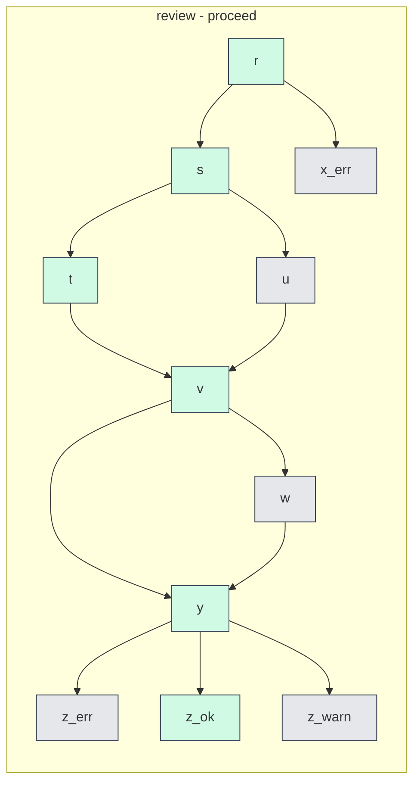

```mermaid
flowchart LR
subgraph review - proceed
  r
  r --> s
  r --> x_err
  s --> t
  s --> u
  t --> v
  u --> v
  v --> w
  v --> y
  w --> y
  y --> z_err
  y --> z_ok
  y --> z_warn
end
style r fill:#dbeafe,stroke:#374151,stroke-width:1px
style z_ok fill:#d1fae5,stroke:#374151,stroke-width:1px
style y fill:#d1fae5,stroke:#374151,stroke-width:1px
style v fill:#d1fae5,stroke:#374151,stroke-width:1px
style t fill:#d1fae5,stroke:#374151,stroke-width:1px
style s fill:#d1fae5,stroke:#374151,stroke-width:1px
style r fill:#d1fae5,stroke:#374151,stroke-width:1px
style u fill:#e5e7eb,stroke:#374151,stroke-width:1px
style w fill:#e5e7eb,stroke:#374151,stroke-width:1px
style x_err fill:#e5e7eb,stroke:#374151,stroke-width:1px
style z_err fill:#e5e7eb,stroke:#374151,stroke-width:1px
style z_warn fill:#e5e7eb,stroke:#374151,stroke-width:1px
```