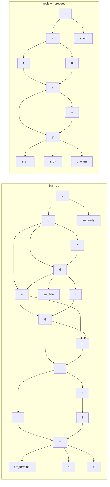

```mermaid
flowchart LR
subgraph init - go
  a
  a --> b
  a --> err_early
  b --> c
  b --> d
  b --> e
  c --> d
  d --> e
  d --> err_late
  d --> f
  e --> g
  e --> h
  f --> g
  g --> h
  g --> i
  h --> i
  i --> j
  i --> k
  j --> m
  k --> l
  l --> m
  m --> err_terminal
  m --> n
  m --> p
end

subgraph review - proceed
  r
  r --> s
  r --> x_err
  s --> t
  s --> u
  t --> v
  u --> v
  v --> w
  v --> y
  w --> y
  y --> z_err
  y --> z_ok
  y --> z_warn
end
```